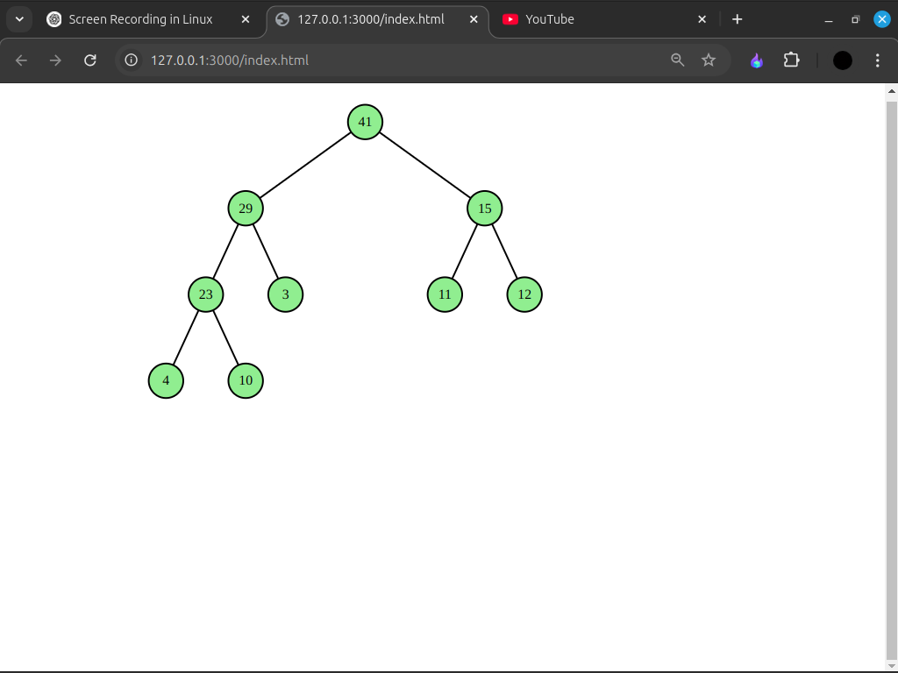

# AlgoVerse

AlgoVerse is a JavaScript library for efficient algorithms, data structures, and interactive visualizations. It helps developers implement and visualize structures like heaps, graphs, and trees in real time.

## Features

- Pre-built data structures like Stack, Queue, Graph, Tree, etc.

- Interactive visualizations using D3.js

- Works in both Node.js and browser environments

- Lightweight and optimized for performance

## 🔥 Problems it Solves

- Provides an easy-to-use interface for implementing complex data structures.

- Helps visualize algorithms step by step for better understanding.

- Reduces the time required to build algorithmic applications from scratch.

## 🛠 Technologies Used

- JavaScript (ES6 Modules)

- D3.js (for visualization)

- Rollup (for bundling the package)

## 📥 Installation

You can use AlgoVerse in two ways: via NPM (recommended) or via CDN.

### using npm

```bash
  npm install algoverse
```

Then, import it in your JavaScript file:

```bash
import * as AlgoVerse from './node_modules/algoverse/dist/algoverse.es.js'

```

### Using CDN (for Browser)

```bash
import * as AlgoVerse from "https://unpkg.com/algoverse@latest/dist/algoverse.es.js";
```

then, you can use it,

## script.js
```bash
const {PriorityQueue} = AlgoVerse;

const pq = new PriorityQueue(false)

pq.push(10)
pq.push(11)
pq.push(23)
pq.push(4)
pq.push(3)
pq.push(12);
pq.push(15);
pq.push(29);
pq.push(41);

pq.show()
```

## index.html

```bash
<!DOCTYPE html>
<html lang="en">
  <head>
    <script src="https://d3js.org/d3.v7.min.js"></script>
    <link rel="stylesheet" href="style.css" />
  </head>
  <body>
    <svg id="visualizer-svg"></svg>
    <script type="module" src="script.js"></script>
  </body>
</html>
```

## style.css

```bash
*{
  margin: 0;
  padding: 0;
}
.box{
  fill: lightblue;
  stroke: black;
  stroke-width: 2;
}
.node {
  fill: lightgreen;
  stroke: black;
  stroke-width: 2;
}
.link {
  stroke: black;
  stroke-width: 2;
}
.text,
.index-text {
  font-size: 16px;
  text-anchor: middle;
}
.index-text {
  fill: gray;
}

#visualizer-svg{
  min-height: 100vh;
  min-width: 100%;
}
```

you will see this:


### Stack:

```bash
push: pushes element to stack
pop: pop the top element from stack
size: size of stack
topElement: returns top element of the stack
show: shows the stack visualisation in the browser
```

### Queue:

```bash
topElement: returns top element of the queue
bottomElement: returns bottom element of the queue:
show: shows the queue visualisation in the browser
size: return the size of the queue
giveAsArray: returns the queue as an array
```

### Linked List:

```bash
push : pushes element at last
shift: pushes element at front
pop: pops element from last, O(n)
unshift: removes element from front
show: shows the linked list visualisation in browser
giveAsArray: gives the list as an array
size: return the no of nodes in linked list
frontElement: returns the front element of list
backElement: returns the back element of the list
```

### Priority Queue:

```bash
topElement: returns the top element
size: returns the size, no of elements
push: pushes an element into priority queue
pop: pops element from priority queue
show: shows the visualisation of the priority queue
isMinHeap: returns true if it is initialised as min heap
```

### Graph:

```bash
getNodes: returns all the nodes or vertices
getEdges: returns all the edges
DFS: do a depth first search on graph
BFS: do a breadth first search on graph
show: shows the visualisation of the graph
```
